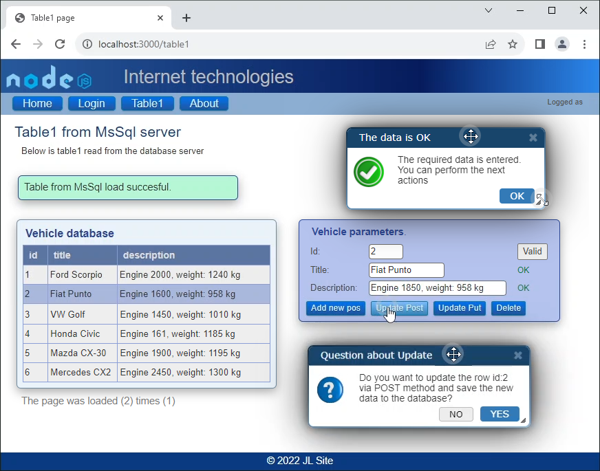
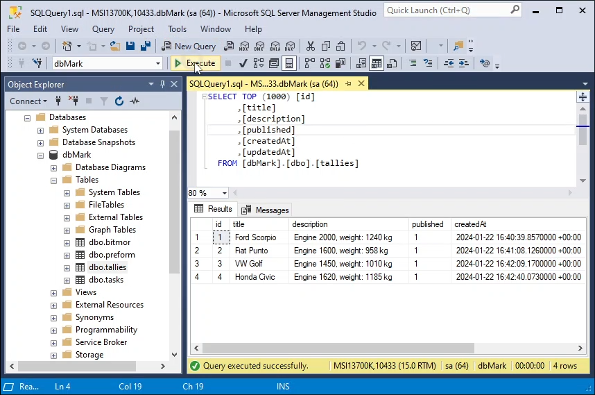
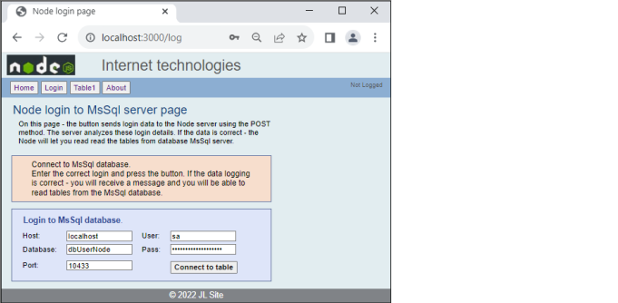

## The Node CRUD MVC app with the Sequelize ORM MsSql framework

The Node Express CRUD MVC application with the Sequelize ORM database framework and file structure: router, controllers, view, model. The application works with the <b>MsSql database. Sequelize</b> is a modern TypeScript ORM framework for Node.js for fast database communication. Featuring solid transaction support, relations, eager and lazy loading, read replication and more.

.

## The idea of a web application

This web application demonstrates the use of CRUD actions (Create, Read, Update, Delete) of GET, POST, PUT, DELETE methods by making browser requests to a node server and vice versa.

This application has:

- Express framework;
- JavaScript language;
- Built-in middleware: express.static;
- Partials (layouts) of header, footer
- Handlebars (Hbs) template engine;
- Helpers: [#each], [#if];
- Multi-page portal - switching from the menu;
- Request handling: Get, Post
- Division into file structure:
    - Server;
    - App_hbs;
    - Routers;
    - Controller applications (POST, PUT, DELETE method);
    - Controller pages (GET method);
    - Model of database;
    - Views;
    - Data class;

.

## Operation of the web application

### Good MVC pattern with separation of operations
This application has a good file structure, following the MVC pattern for separating back-end tasks: application, router, controllers, views, models. Many websites are used in large web-apps. Handling multiple pages in one file - causes confusion and lack of order. Therefore, tasks are divided into different folders and files. GET commands are handled by PagesController.js, POST, PUT, DELETE by ApplicationsController.js and separation is handled by: \routes\router.js. Pages are switched via the Get method. The router finds the correct EndPoint and based on it, renders the page to the browser.

### Database login
On the Log page - the button sends login data to the Node server using the POST method. To log in to the MsSql server, you need to enter several fields correctly. The server analyzes these login details. If the data is correct - Node will return the data from MsSql for display.

### Automatic Sequelize operation
When the required table is not present in the database - you do not need to create the table via SQL query - the Sequelize framework will create this table automatically. This is a great advantage of the Sequelize OMR framework.

### Next actions
In the table1 page you can run/use actions: Create, Read, Update, Delete.

